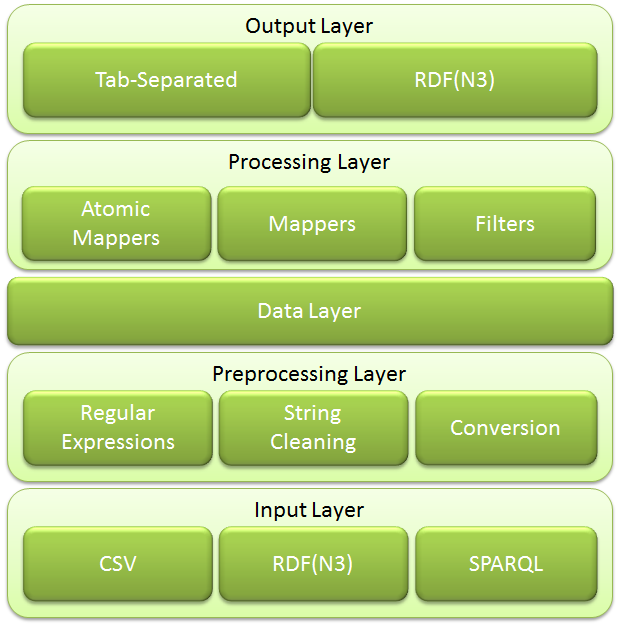

#User Manual (Version 1.0.0)

Introduction
============

LIMES, the **Li**nk Discovery Framework for **Me**tric **S**paces, is a
framework for discovering links between entities contained in Linked
Data sources. LIMES is a hybrid framework that combines the mathematical
characteristics of metric spaces as well prefix-, suffix- and position
filtering to compute pessimistic approximations of the similarity of
instances. These approximations are then used to filter out a large
amount of those instance pairs that do not suffice the mapping
conditions. By these means, LIMES can reduce the number of comparisons
needed during the mapping process by several orders of magnitude and
complexity without loosing a single link.

 

The general workflow implemented by the LIMES framework is depicted in
Figure [#workflow]. Given the source S, the target T and a link
specification, LIMES first separates the different data types to merge.
Strings are processed by using suffix-, prefix- and position filtering
in the string mapper. Numeric values (and all values that can be mapped
efficiently to a vector space) are mapped to a metric space and
processed by the HYPPO algorithm. All other values are mapped by using
the miscellaneous mapper. The results of all mappers processing are
filtered and merged by using time-efficient set and filtering
operations.

**TODO** Axel Change according to the new workflow

The advantages of LIMES’ approach are manifold. First, it implements
**highly time-optimized** mappers, making it a complexity class faster
than other Link Discovery Frameworks. Thus, the larger the problem, the
faster LIMES is w.r.t. other Link Discovery Frameworks. In addition,
**LIMES is guaranteed to lead to exactly the same matching as a brute
force approach while at the same time reducing significantly the number
of comparisons**. In addition, LIMES supports a **large number of input
and output formats** and can be extended very easily to fit new
algorithms , new datatypes, new preprocessing functions and others thank
to its modular architecture displayed in Figure [fig:architecture].

[fig:architecture]

In general, LIMES can be used to set links between two data sources,
e.g., a novel data source created by a data publisher and existing data
source such as DBpedia. This functionality can also be used to
detect duplicates within one data source for knowledge curation. The
only requirement to carry out these tasks is a simple XML-based
configuration file. The purpose of this manual is to explicate the LIMES
Configuration Language (LCL) that underlies these configuration files,
so as allow users to generate their own configurations. An online
version of LIMES is available online at
http://limes.aksw.org.

#Components of a LIMES XML Configuration File
A LIMES configuration file consists of ten parts, of which some are optional:

## Metadata
The `metadata` tag always consists of the following bits of XML:

    <?xml version="1.0" encoding="UTF-8"?>
    <!DOCTYPE LIMES SYSTEM "limes.dtd">
    <LIMES>

## Prefixes
Defining a prefix in a LIMES file demands setting two values: 
 The `namespace` that will be addressed by the prefix's `label`

    <PREFIX>
        <NAMESPACE>http://www.w3.org/1999/02/22-rdf-syntax-ns#</NAMESPACE>
        <LABEL>rdf</LABEL>
    </PREFIX>

Here, we set the prefix `rdf` to correspond to `http://www.w3.org/1999/02/22-rdf-syntax-ns\#`. A LIMES link specification can contain as many prefixes as required.

## Source Data Source
LIMES computes links between items contained in two Linked Data sources dubbed source and target. An example of a configuration for a source data source is shown below.

    <SOURCE>
        <ID>mesh</ID>
        <ENDPOINT>http://mesh.bio2rdf.org/sparql</ENDPOINT>
        <VAR>?y</VAR>
        <PAGESIZE>5000</PAGESIZE>
        <RESTRICTION>?y rdf:type meshr:Concept</RESTRICTION>
        <PROPERTY>dc:title</PROPERTY>
        <TYPE>sparql</TYPE>
    </SOURCE>

Six properties need to be set. 

* Each data source must be given an ID via the tag `ID`.
* The endpoint of the data source needs to be explicated via the `ENDPOINT` tag. 
    + In the data to be queried from a SPARQL end point, the `ENDPOINT` tag is set to the SPARQL endpoint URI.
    + In case the data is stored in a local files (CSV, N3, TURTLE, etc.), `ENDPOINT` tag is to be set to the absolute path of the file containing the data to link.
* The variable associated with this endpoint must be specified. This is done by setting the `VAR` tag. This variable is used later when specifying the metric used to compare the entities retrieved from the source and target endpoints.
* The fourth property is set via the `PAGESIZE` tag. This property must be set to the maximal number of triples returned by the SPARQL endpoint to address. For example, the [DBpedia endpoint](http://dbpedia.org/sparql) returns a maximum of 1000 triples for each query. LIMES' SPARQL module can still retrieve all relevant instances for the mapping if given this value. If the SPARQL endpoint does not limit the number of triple it returns or if the input is a file, the value of `PAGESIZE` should be set to -1. 
* The restrictions of the data to retrieved can be set via the `RESTRICTION` tag. This tag allows to limit the entries that are retrieved the LIMES' query module. In this particular example, we only instances of MESH concepts. 
* The `PROPERTY` tag allows to specify the properties that will be used during the linking. It is important to note that the property tagcan also be used to specify the preprocessing on the input data. For example, setting `rdfs:label AS nolang`, one can ensure that the language tags get removed from each `rdfs:label` before it is written in the cache. Pre-processing functions can be piped into one another by using `->`. For example, `rdfs:label AS nolang->lowercase` will compute `lowercase(nolang(rdfs:label))`.

The pre-processing functions include: 
* `nolang` for removing language tags, 
* `lowercase` for converting the input string into lower case,  
* `uppercase` for converting the input string into upper case, 
* `number` for ensuring that only the numeric characters, "." and "," are contained in the input string,
* `replace(String a,String b)` for replacing each occurrence of `a` with `b`,
* `cleaniri` for removing all the prefixes from IRIs,
* `celsius` for converting Fahrenheit to Celsius,
* `fahrenheit` for converting Celsius to Fahrenheit.
**TODO** Sherif check for completness

Sometimes, generating the right link specification might either require merging property values (for example, the `dc:title` and `foaf:name` of MESH concepts) or splitting property values (for example, comparing the label and `foaf:homepage` of source instances and the `foaf:homepage` of target instances as well as `foaf:homepage AS cleaniri` of the target instances with the `rdfs:label` of target instances. To enable this goal, LIMES provides the `RENAME` operator which simply store either the values of a property or the results of a preprocessing into a different property field. For example, `foaf:homepage AS cleaniri RENAME label` would stored the homepage of a object without all the prefixes in the name property. The user could then access this value during the specification of the similarity measure for comparing sources and target instances. Note that the same property value can be used several times. Thus, the following specification fragment is valid and leads to the the `dc:title` and `foaf:name` of individuals)  of MESH concepts being first cast down to the lowercase and then merged to a single property.

    <SOURCE>
        <ID>mesh</ID>
        <ENDPOINT>http://mesh.bio2rdf.org/sparql</ENDPOINT>
        <VAR>?y</VAR>
        <PAGESIZE>5000</PAGESIZE>
        <RESTRICTION>?y rdf:type meshr:Concept</RESTRICTION>
        <PROPERTY>dc:title AS lowercase RENAME name</PROPERTY>
        <PROPERTY>foaf:name AS lowercase RENAME name</PROPERTY>
        <TYPE>sparql</TYPE>
    </SOURCE>

In addition, the following allows splitting the values of `foaf:homepage` into the property values `name` and `homepage`.

    <SOURCE>
        <ID>mesh</ID>
        <ENDPOINT>http://mesh.bio2rdf.org/sparql</ENDPOINT>
        <VAR>?y</VAR>
        <PAGESIZE>5000</PAGESIZE>
        <RESTRICTION>?y rdf:type meshr:Concept</RESTRICTION>
        <PROPERTY>foaf:homepage AS lowercase RENAME homepage</PROPERTY>
        <PROPERTY>foaf:homepage AS cleaniri->lowercase RENAME name</PROPERTY>
        <TYPE>sparql</TYPE>
    </SOURCE>

In addition, a source type can be set via `TYPE`. The default type is set to `SPARQL` (for a SPARQL endpoint) but LIMES also supports reading files directly from the harddrive. The supported data formats are
* `CSV`: Character-separated file can be loaded directly into LIMES. Note that the separation character is set to `TAB` as a default. The user can alter this setting programmatically. 
* `N3` (which also reads `NT` files) reads files in the `N3` language.
* `N-TRIPLE` reads files in W3C's core [N-Triples format](http://www.w3.org/TR/rdf-testcases/\#ntriples)
*  `TURTLE` allows reading files in the `Turtle` [syntax](http://www.w3.org/TR/turtle/).

Consequently, if you want to download data from a SPARQL endpoint, there is no need to set the `<TYPE>` tag. 
If instead you want to read the source (or target) data from a file, the `<ENDPOINT>` tag should contain the path to the file to read, e.g. `<ENDPOINT>C:/Files/dbpedia.nt</ENDPOINT>`
In addition, the `<TYPE>` tag then needs to be set, for example by writing `<TYPE>NT</TYPE>`.

##Target Data Source
Configuring the target data source is very similar to configuring the source data source. The only difference lies in the beginning tag, i.e., `TARGET` instead of `SOURCE`. In the example shown below, we retrieve the `condition_name` of a condition from LinkedCT. We do no set the type of the source. Thus, LIMES supposes it is a SPARQL endpoint.

    <TARGET>
        <ID>linkedct</ID>
        <ENDPOINT>http://data.linkedct.org/sparql</ENDPOINT>
        <VAR>?x</VAR>
        <PAGESIZE>5000</PAGESIZE>
        <RESTRICTION>?x rdf:type linkedct:condition</RESTRICTION>
        <PROPERTY>linkedct:condition_name</PROPERTY>
    </TARGET>

## Metric Expression for Similarity Measurement
One of the core improvements of the newest LIMES kernels is the provision of a highly flexible language for the specification of complex metrics for linking (set by using the `METRIC` tag as exemplified below).

    <METRIC>
        trigrams(y.dc:title, x.linkedct:condition_name)
    </METRIC>

In this example, we use the `trigrams` metric to compare the `dc:title` of the instances retrieved from the source data source, with which the variable `y` is associated, with the `linkedct:` variable `x` is associated. While such simple metrics can be used in many cases, complex metrics are necessary in complex linking cases. LIMES includes a formal grammar for specifying complex configurations of arbitrary complexity. For this purpose, two categories of binary operations are supported: Metric operations and boolean operations.

####Metric operations
Metric operations allow to combine metric values. They include the operators `MIN`, `MAX`, `ADD` and `MULT`, e.g. as follows:

    MAX(trigrams(x.rdfs:label,y.dc:title),euclidean(x.lat|long, y.latitude|longitude)).

This specification computes the maximum of 
1 The trigram similarity of x's \texttt{rdfs:label} and y's `dc:title` 
2 The 2-dimension euclidean distance of `x`'s `lat` and `long` with `y`'s `latitude` and `longitude`, i.e., `√((x.lat- y.latitude)^2 + (x.long - y.longitude)^2)`. 

Note that euclidean supports arbitrarily many dimensions. In addition, note that `ADD` allows to define weighted sums as follows:`ADD(0.3*trigrams(x.rdfs:label,y.dc:title), 0.7*euclidean(x.lat|x.long,y.latitude|y.longitude))`.

####Boolean operations
Boolean operations allow to combine and filter the results of metric operations and include `AND`, `OR`, `DIFF`, e.g. as `AND(trigrams(x.rdfs:label,y.dc:title)|0.9, euclidean(x.lat|x.long, y.latitude|y.longitude)|0.7)`.

This specification returns all links such that 
1. the trigram similarity of `x`'s `rdfs:label` and `y`'s `dc:title` is greater or equal to 0.9 and 
2. the 2-dimension euclidean distance of `x`'s `lat` and `long` mit y's `latitude` and `longitude` is greater or equal to `0.7`.

The current version of LIMES supports the string following metrics:

* `Trigrams`
* `Cosine`
* `Jaccard`  
* `Levenshtein`
* `Overlap` 
* `Jaro` 
* `JaroWinkler`
* `MongeElkan` 
* `ExactMatch`
* `Qgrams`
* `RatcliffObershelp`
* `Soundex`
* `Trigram`

In addition, LIMES supports comparing numeric vectors by using the 
* `Euclidean` metric as well as 
* the `Geo_Orthodromic` distance and
* `Geo_Great_Elliptic` distance

The similarity between polygons can be measured by using the following point-set distances:
* `Geo_Orthodromic`
* `Geo_NaiveHausdorff` 
* `Geo_Indexed_Hausdorff` 
* `Geo_Fast_Hausdorff` 
* `Geo_Symmetric_Hausdorff`
* `Geo_Centroid_Indexed_Hausdorff`
* `Geo_Scan_Indexed_Hausdorff`
* `Geo_Max`
* `Geo_Min`
* `Geo_Mean`
* `Geo_Avg`
* `Geo_Frechet`
* `Geo_Link`
* `Geo_Sum_Of_Min`
* `Geo_Naive_Surjection`
* `Geo_Fair_Surjection`

The temporal relations between event resources can be found by using the following distances:
* `Tmp_Successor`
* `Tmp_Predecessor`
* `Tmp_Concurrent`
* `Tmp_Before`
* `Tmp_After`
* `Tmp_Meets`
* `Tmp_Is_Met_By`
* `Tmp_Finishes`
* `Tmp_Is_Finished_By`
* `Tmp_Starts`
* `Tmp_Is_Stared_By`
* `Tmp_During`
* `Tmp_During_Reverse`
* `Tmp_Overlaps`
* `Tmp_Is_Overlapped_By`
* `Tmp_Equals`

The topological relations between spatial resources can be found by using the following distances:
* `Top_Contains`
* `Top_Crosses`
* `Top_Disjoint`
* `Top_Equals`
* `Top_Intersects`
* `Top_Overlaps`
* `Top_Touches`
* `Top_Within`

More complex distance measures are being added.

## Machine Learning
In most cases, finding a good eetric expression (i.s. one that achieve high F-Measure) is not a trivial task. Therefore, in LIMES we implemented a number of machine learning algorithm for auto-generation of metric (also called Link Specification). For using a machine learning algorithm in your configuration file use the `MLALGORITHM` tag instead of the `METRIC` tag. For example:

	<MLALGORITHM>
		<NAME>wombat simple</NAME>
		<TYPE>supervised batch</TYPE>
		<TRAINING>trainingData.nt</TRAINING>
		<PARAMETER> 
			<NAME>max execution time in minutes</NAME>
			<VALUE>60</VALUE>
		</PARAMETER>
	</MLALGORITHM>

In particular:
* The the tag `NAME` contains the name of the machine learning algorithm. Currently, we implemented the folowing algorithms:
    + womabt simple
    + wombat complete
    + eagle
* The the tag `TYPE` contains the type of the machine learning algorithm, which could tak one of the values:
    + supervised batch
    + supervised active
    + unsupervised
* The the tag `TRAINING` contains the full path to the training data file. Note that this tag is not required in case of the supervised active and unsupervised learning algorithms
* The the tag `PARAMETER` contains the the name (using the sub-tag `NAME`) and the value (using the sub-tag `VALUE`) of the used machine learning algorithm parameter. User can use as many `PARAMETER` tags as (s)he needs. Note that LIMES uses the default values of all unspecified parameters. 

The following table contains a list of implemented algorithms together with supported implementations and parameters.

<table class="tg">
  <tr>
    <th class="tg-yw4l">ML Algorithm </th>
    <th class="tg-yw4l">Supported types </th>
    <th class="tg-yw4l">Parameter</th>
    <th class="tg-yw4l">Default Value </th>
    <th class="tg-yw4l">Note</th>
  </tr>
  <tr>
    <td class="tg-baqh" rowspan="13">WOMBAT Simple </td>
    <td class="tg-yw4l" rowspan="13">supervised batch, supervised active and unsupervised</td>
    <td class="tg-yw4l">max refinement tree size</td>
    <td class="tg-yw4l">2000</td>
    <td class="tg-yw4l"></td>
  </tr>
  <tr>
    <td class="tg-yw4l">max iterations number</td>
    <td class="tg-yw4l">3</td>
    <td class="tg-yw4l"></td>
  </tr>
  <tr>
    <td class="tg-yw4l">max iteration time in minutes</td>
    <td class="tg-yw4l">20</td>
    <td class="tg-yw4l"></td>
  </tr>
  <tr>
    <td class="tg-yw4l">max execution time in minutes</td>
    <td class="tg-yw4l">600</td>
    <td class="tg-yw4l"></td>
  </tr>
  <tr>
    <td class="tg-yw4l">max fitness threshold</td>
    <td class="tg-yw4l">1</td>
    <td class="tg-yw4l">Range 0 to 1</td>
  </tr>
  <tr>
    <td class="tg-yw4l">minimum property coverage</td>
    <td class="tg-yw4l">0.4</td>
    <td class="tg-yw4l">Range 0 to 1</td>
  </tr>
  <tr>
    <td class="tg-yw4l">property learning rate</td>
    <td class="tg-yw4l">0.9</td>
    <td class="tg-yw4l">Range 0 to 1</td>
  </tr>
  <tr>
    <td class="tg-yw4l">overall penalty weight</td>
    <td class="tg-yw4l">0.5 </td>
    <td class="tg-yw4l">Range 0 to 1 </td>
  </tr>
  <tr>
    <td class="tg-yw4l">children penalty weight</td>
    <td class="tg-yw4l">1</td>
    <td class="tg-yw4l">Range 0 to 1</td>
  </tr>
  <tr>
    <td class="tg-yw4l">complexity penalty weight</td>
    <td class="tg-yw4l">1</td>
    <td class="tg-yw4l">Range 0 to 1</td>
  </tr>
  <tr>
    <td class="tg-yw4l">verbose</td>
    <td class="tg-yw4l">false</td>
    <td class="tg-yw4l"></td>
  </tr>
  <tr>
    <td class="tg-yw4l">atomic measures</td>
    <td class="tg-yw4l">jaccard, trigrams, cosine, qgrams</td>
    <td class="tg-yw4l"></td>
  </tr>
  <tr>
    <td class="tg-yw4l">save mapping</td>
    <td class="tg-yw4l">true</td>
    <td class="tg-yw4l"></td>
  </tr>
  <tr>
    <td class="tg-yw4l">WOMBAT Complete </td>
    <td class="tg-yw4l">supervised batch, supervised active and unsupervised</td>
    <td class="tg-yw4l" colspan="3">Same as WOMBAT Simple </td>
  </tr>
  <tr>
    <td class="tg-yw4l">EAGLE</td>
    <td class="tg-yw4l">supervised batch, supervised active and unsupervised</td>
    <td class="tg-yw4l">**TODO** Tomasso </td>
    <td class="tg-yw4l"></td>
    <td class="tg-yw4l"></td>
  </tr>
</table>
    	
  
##Acceptance Condition
Setting the acceptance condition basically consists of setting the value for the threshold above which links are considered to be valid and not to required further curation. This can be carried out as exemplified below.

    <ACCEPTANCE>
        <THRESHOLD>0.98</THRESHOLD>
        <FILE>accepted.nt</FILE>
        <RELATION>owl:sameAs</RELATION>
    </ACCEPTANCE>

By using the \verb#THRESHOLD# tag, the user can set the value for the metric value above which two instances are considered to be linked via the relation specified by using the tag \verb#RELATION#, i.e., \verb#owl:sameAs# in our example. Setting the tag `<FILE>` allows to specify where the links should be written. Currently, LIMES produces output files in the N3 format.

Future versions of LIMES will allow to write the output to other streams and in other data formats.

## Review Condition
Setting the condition upon which links must be reviewed manually is very similar to setting the acceptance condition as shown below.

    <REVIEW>
        <THRESHOLD>0.95</THRESHOLD>
        <FILE>reviewme.nt</FILE>
        <RELATION>owl:sameAs</RELATION>
    </REVIEW>

All instances that have a similarity between the threshold set in `REVIEW` (0.95 in our example) and the threshold set in `ACCEPTANCE` (0.98 in our example) will be written in the review file and linked via the relation set in `REVIEW`. 
 
The LIMES configuration file should be concluded with `</LIMES>`

## Granularity (optional)

The user can choose positive integers to set the granularity of HYPPO, HR3 or ORCHID by setting

    <GRANULARITY>2</GRANULARITY>.

## Output Format
The user can choose between TAB and N3 as output format by setting

    <OUTPUT>N3</OUTPUT>

## Execution (optional)
Three LIMES execution parameters could be set here:
* `REWRITER`: LIMES 1.0.0 implements the `DEFAULT` rewriter.
* `PLANNER`: the user can choose between:
	* `CANONICAL`: It generates an immutable plan in a static manner.
	* `HELIOS`: It generates an immutable plan in a dynamic manner.
	* `DYNAMIC`: It generates an mutable plan in a dynamic manner.
	* `DEFAULT`: same as `CANONICAL`.
* `ENGINE`: the user can choose between:
	* `SIMPLE`: It executes each independent part of the plan sequentially.
	* `DEFAULT`: same as `SIMPLE`.

if not set, the `DEFAULT` value for each parameter will used be will

## Example of a Configuration Files
The following shows the whole configuration file for LIMES explicated in the sections above.

    <?xml version="1.0" encoding="UTF-8" standalone="no"?>
    <!DOCTYPE LIMES SYSTEM "limes.dtd">
    <LIMES>
	<PREFIX>
		<NAMESPACE>http://geovocab.org/geometry#</NAMESPACE>
		<LABEL>geom</LABEL>
	</PREFIX>
	<PREFIX>
		<NAMESPACE>http://www.opengis.net/ont/geosparql#</NAMESPACE>
		<LABEL>geos</LABEL>
	</PREFIX>
	<PREFIX>
		<NAMESPACE>http://linkedgeodata.org/ontology/</NAMESPACE>
		<LABEL>lgdo</LABEL>
	</PREFIX>
	<SOURCE>
		<ID>linkedgeodata</ID>
		<ENDPOINT>http://linkedgeodata.org/sparql</ENDPOINT>
		<VAR>?x</VAR>
		<PAGESIZE>2000</PAGESIZE>
		<RESTRICTION>?x a lgdo:RelayBox</RESTRICTION>
		<PROPERTY>geom:geometry/geos:asWKT RENAME polygon</PROPERTY>
	</SOURCE>
	<TARGET>
		<ID>linkedgeodata</ID>
		<ENDPOINT>http://linkedgeodata.org/sparql</ENDPOINT>
		<VAR>?y</VAR>
		<PAGESIZE>2000</PAGESIZE>
		<RESTRICTION>?y a lgdo:RelayBox</RESTRICTION>
		<PROPERTY>geom:geometry/geos:asWKT RENAME polygon</PROPERTY>
	</TARGET>
	<METRIC>geo_hausdorff(x.polygon, y.polygon)</METRIC>
	<ACCEPTANCE>
		<THRESHOLD>0.9</THRESHOLD>
		<FILE>lgd_relaybox_verynear.nt</FILE>
		<RELATION>lgdo:near</RELATION>
	</ACCEPTANCE>
	<REVIEW>
		<THRESHOLD>0.5</THRESHOLD>
		<FILE>lgd_relaybox_near.nt</FILE>
		<RELATION>lgdo:near</RELATION>
	</REVIEW>

	<EXECUTION>
		<REWRITER>default</REWRITER>
		<PLANNER>default</PLANNER>
		<ENGINE>default</ENGINE>
	</EXECUTION>

	<OUTPUT>TAB</OUTPUT>
</LIMES>

LIMES can be also configured using a RDF configuration file, the next
listing represent the same LIMES configuration used in the previous XML
file.

	@prefix geos:    <http://www.opengis.net/ont/geosparql#> .
	@prefix lgdo:    <http://linkedgeodata.org/ontology/> .
	@prefix rdfs:    <http://www.w3.org/2000/01/rdf-schema#> .
	@prefix geom:    <http://geovocab.org/geometry#> .
	@prefix limes:   <http://limes.sf.net/ontology/> .
	
	limes:linkedgeodataTOlinkedgeodataTarget
	      a       limes:TargetDataset ;
	      rdfs:label "linkedgeodata" ;
	      limes:endPoint "http://linkedgeodata.org/sparql" ;
	      limes:pageSize "2000" ;
	      limes:property "geom:geometry/geos:asWKT" ;
	      limes:restriction "?y a lgdo:RelayBox" ;
	      limes:variable "?y" .
	
	limes:linkedgeodataTOlinkedgeodata
	      a       limes:LimesSpecs ;
	      limes:hasExecutionParameters limes:executionParameters ;
	      limes:granularity "2" ;
	      limes:hasAcceptance limes:linkedgeodataTOlinkedgeodataAcceptance ;
	      limes:hasMetric limes:linkedgeodataTOlinkedgeodataMetric ;
	      limes:hasReview limes:linkedgeodataTOlinkedgeodataReview ;
	      limes:hasSource limes:linkedgeodataTOlinkedgeodataSource ;
	      limes:hasTarget limes:linkedgeodataTOlinkedgeodataTarget ;
	      limes:outputFormat "TAB" .
	      
	limes:executionParameters
		  a limes:ExecutionParameters ;
		  limes:executionPlanner "default" ;
		  limes:executionRewriter "default" ;
		  limes:executionEngine "default" .
		  
	      
	limes:linkedgeodataTOlinkedgeodataReview
	      a       limes:Review ;
	      limes:file "lgd_relaybox_near.nt" ;
	      limes:relation "lgdo:near" ;
	      limes:threshold "0.5" .
	
	limes:linkedgeodataTOlinkedgeodataMetric
	      a       limes:Metric ;
	      limes:expression "geo_hausdorff(x.polygon, y.polygon)" .
	
	limes:linkedgeodataTOlinkedgeodataAcceptance
	      a       limes:Acceptance ;
	      limes:file "lgd_relaybox_verynear.nt" ;
	      limes:relation "lgdo:near" ;
	      limes:threshold "0.9" .
	
	limes:linkedgeodataTOlinkedgeodataSource
	      a       limes:SourceDataset ;
	      rdfs:label "linkedgeodata" ;
	      limes:endPoint "http://linkedgeodata.org/sparql" ;
	      limes:pageSize "2000" ;
	      limes:property "geom:geometry/geos:asWKT" ;
	      limes:restriction "?x a lgdo:RelayBox" ;
	      limes:variable "?x" .

The following configuration file uses the machine learning algorithm of the Wombat simple to find the metric expression for the same example:

	<?xml version="1.0" encoding="UTF-8" standalone="no"?>
	<!DOCTYPE LIMES SYSTEM "limes.dtd">
	<LIMES>
	<PREFIX>
		<NAMESPACE>http://geovocab.org/geometry#</NAMESPACE>
		<LABEL>geom</LABEL>
	</PREFIX>
	
	<PREFIX>
		<NAMESPACE>http://www.opengis.net/ont/geosparql#</NAMESPACE>
		<LABEL>geos</LABEL>
	</PREFIX>
	
	<PREFIX>
		<NAMESPACE>http://linkedgeodata.org/ontology/</NAMESPACE>
		<LABEL>lgdo</LABEL>
	</PREFIX>
	
	<SOURCE>
		<ID>linkedgeodata</ID>
		<ENDPOINT>http://linkedgeodata.org/sparql</ENDPOINT>
		<VAR>?x</VAR>
		<PAGESIZE>2000</PAGESIZE>
		<RESTRICTION>?x a lgdo:RelayBox</RESTRICTION>
		<PROPERTY>geom:geometry/geos:asWKT RENAME polygon</PROPERTY>
	</SOURCE>

	<TARGET>
		<ID>linkedgeodata</ID>
		<ENDPOINT>http://linkedgeodata.org/sparql</ENDPOINT>
		<VAR>?y</VAR>
		<PAGESIZE>2000</PAGESIZE>
		<RESTRICTION>?y a lgdo:RelayBox</RESTRICTION>
		<PROPERTY>geom:geometry/geos:asWKT RENAME polygon</PROPERTY>
	</TARGET>
	
	<MLALGORITHM>
		<NAME>wombat simple</NAME>
		<TYPE>supervised batch</TYPE>
		<TRAINING>trainingData.nt</TRAINING>
		<PARAMETER> 
			<NAME>max execution time in minutes</NAME>
			<VALUE>60</VALUE>
		</PARAMETER>
	</MLALGORITHM>
	
	<ACCEPTANCE>
		<THRESHOLD>0.9</THRESHOLD>
		<FILE>lgd_relaybox_verynear.nt</FILE>
		<RELATION>lgdo:near</RELATION>
	</ACCEPTANCE>
	
	<REVIEW>
		<THRESHOLD>0.5</THRESHOLD>
		<FILE>lgd_relaybox_near.nt</FILE>
		<RELATION>lgdo:near</RELATION>
	</REVIEW>

	<EXECUTION>
		<REWRITER>default</REWRITER>
		<PLANNER>default</PLANNER>
		<ENGINE>default</ENGINE>
	</EXECUTION>

	<OUTPUT>TAB</OUTPUT>
</LIMES>

Finally, the last XML configuration file in TTL format will look like:

	@prefix geos:    <http://www.opengis.net/ont/geosparql#> .
	@prefix lgdo:    <http://linkedgeodata.org/ontology/> .
	@prefix rdfs:    <http://www.w3.org/2000/01/rdf-schema#> .
	@prefix geom:    <http://geovocab.org/geometry#> .
	@prefix limes:   <http://limes.sf.net/ontology/> .
	
	limes:linkedgeodataTOlinkedgeodataTarget
	      a       limes:TargetDataset ;
	      rdfs:label "linkedgeodata" ;
	      limes:endPoint "http://linkedgeodata.org/sparql" ;
	      limes:pageSize "2000" ;
	      limes:property "geom:geometry/geos:asWKT" ;
	      limes:restriction "?y a lgdo:RelayBox" ;
	      limes:variable "?y" .
	
	limes:linkedgeodataTOlinkedgeodata
	      a       limes:LimesSpecs ;
	      limes:hasExecutionParameters limes:executionParameters ;
	      limes:granularity "2" ;
	      limes:hasAcceptance limes:linkedgeodataTOlinkedgeodataAcceptance ;
	      limes:hasMetric limes:linkedgeodataTOlinkedgeodataMetric ;
	      limes:hasReview limes:linkedgeodataTOlinkedgeodataReview ;
	      limes:hasSource limes:linkedgeodataTOlinkedgeodataSource ;
	      limes:hasTarget limes:linkedgeodataTOlinkedgeodataTarget ;
	      limes:outputFormat "TAB" .
	      
	limes:executionParameters
		  a limes:ExecutionParameters ;
		  limes:executionPlanner "default" ;
		  limes:executionRewriter "default" ;
		  limes:executionEngine "default" .
		  
	      
	limes:linkedgeodataTOlinkedgeodataReview
	      a       limes:Review ;
	      limes:file "lgd_relaybox_near.nt" ;
	      limes:relation "lgdo:near" ;
	      limes:threshold "0.5" .
	
	limes:linkedgeodataTOlinkedgeodataMetric
	      a       limes:Metric ;
	      limes:expression "geo_hausdorff(x.polygon, y.polygon)" .
	
	limes:linkedgeodataTOlinkedgeodataAcceptance
	      a       limes:Acceptance ;
	      limes:file "lgd_relaybox_verynear.nt" ;
	      limes:relation "lgdo:near" ;
	      limes:threshold "0.9" .
	
	limes:linkedgeodataTOlinkedgeodataSource
	      a       limes:SourceDataset ;
	      rdfs:label "linkedgeodata" ;
	      limes:endPoint "http://linkedgeodata.org/sparql" ;
	      limes:pageSize "2000" ;
	      limes:property "geom:geometry/geos:asWKT" ;
	      limes:restriction "?x a lgdo:RelayBox" ;
	      limes:variable "?x" .
The LIMES Distribution
======================

Running the Framework
---------------------
**TODO** Kevin please update this section
Once the configuration file (dubbed `config.xml` in this manual) has
been written, the last step consists of actually running the LIMES
framework. For this purpose, simply run

`java -jar LIMES.jar config.xml`.

In case your system runs out of memory, please use the `-Xmx` option to
allocate more memory to the Java Virtual Machine. Please ensure that the
Data Type Definition file for LIMES, `limes.dtd`, is in the same folder
as the `LIMES.jar` and everything should run just fine. Enjoy.

Known Issues
============

None.

Change log
==========

Version 1.0.0
-------------
-  Kernel update
-  Machine learning algorithm support
-  Added support for several topological functions (within, intersects, ...)
-  New GUI

Version 0.6RC4
--------------
-   Added support for several geo-spatial similarity functions (geomean, surjection, fairsurjection, geosumofmin, frechet, link)
-   Added support for temporal geo-spatial similarity functions (daysim, datesim, yearsim)
-   Added parallel implementation for ORCHID
-   Added support for Jaro and Jaro-Winkler

Version 0.6RC3
--------------
-   Added support for geo-spatial similarity function based on Hausdorff distance
-   Added support for geo-spatial similarity function based on symmetric Hausdorff distance
-   Added support for orthodromic distance
-   Implemented ORCHID for time-efficient linking of geo-spatial resources
-   Added support for exact matches

Version 0.6RC2
--------------
-   Time-efficient self-configuration (genetic, linear, boolean)
-   Can now read use most RDF serialization formats (RDF/XML, N3, NT, TTL) as input

Version 0.6RC1
--------------
-   Kernel update
-   HR3 algorithm for vector space. Default granularity is now 4
-   Update for data readers and writers.
-   Genetic Learning

Version 0.5RC1
--------------
-   Kernel change, more than 4 orders of magnitude faster
-   HYPPO algorithm for vector spaces
-   Fast prefix, suffix and position filtering for strings
-   Support for more metrics

Version 0.4.1
-------------
-   Added support for data source type (tab-separated vectors)
-   Added factory for query modules

Version 0.4
-----------
-   Added support for data source type (Sparql, CSV)
-   Added hybrid cache
-   Implemented CSV reader
-   Faster organizer

[^2]: <http://www.w3.org/TR/rdf-testcases/#ntriples>

[^3]: <http://www.w3.org/TR/turtle/>
