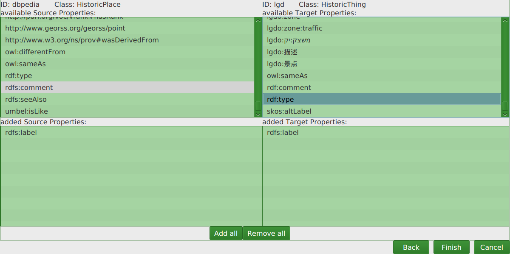

#How to create a new configuration

## Endpoint configuration
After clicking on *File* -> *New* a window pops up in which the source and target endpoints of the new configuration can be configured

* *EndpointURL*: Either a URL of a SPARQL Endpoint is entered here, or the filepath to a local endpoint. 
Files can also be entered more easily by pressing the little green button with the file symbol which opens a file chooser dialog.
* *ID/Namespace*: Source/Target Endpoint can be given a name (optional)
* *Graph*: Specify the graph, if this is left empty, the default graph will be used
* *Page size*: How many pages of the endpoint should be fetched? (-1 = all)

Let's use `http://dbpedia.org/sparql` as source endpoint and `http://linkedgeodata.org/sparql` as target endpoint URL.
We enter `dbpedia` as source ID and `lgd` as target ID.

Pressing *Next* gets you to the next step:

## Class matching

A source and target class must be selected by clicking on it to continue. Some classes have subclasses which can be accessed by clicking on the arrow besides them.
We click on `HistoricPlace` from dbpedia and `HistoricThing` from lgd.
The *Next* step is:

## Property Matching

Clicking on the available properties moves them to the bottom container, where the already added properties can be seen. If you
change your mind, clicking on added properties moves them back up. Alternatively all available properties can be added with the button *Add All*.
At least one source and one target property has to be added.

Let's take `rdfs:label` for both. Since the properties are alphabetically sorted you can find those towards the bottom of each list.

Press *Finish* and you are now ready to build a metric!
