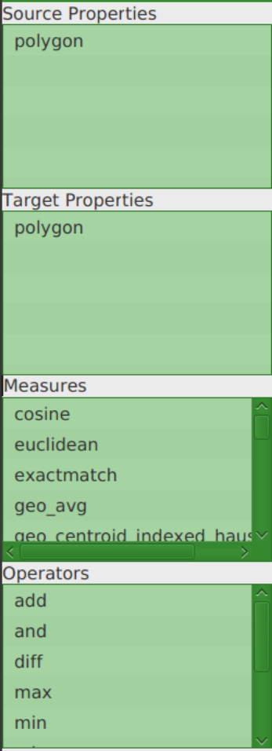

# Running LIMES {#top}

LIMES can be run in three modes: CLI client, CLI server and GUI client.
All modes offer the same functionality but over different interfaces to support a variety of use cases.    

## Client
For this purpose, simply run

```bash
java -jar path_to_limes.jar config.xml [OPTIONS...]
```

The following optional command line flags and options are available:

* `-f $format` sets the format of configuration file. Possible values for `$format` are`"XML"` (default) or `"RDF"`
* `-d $file_path` configure the path for the statistics JSON output file
* `-1` enforces 1-to-1 mappings, i.e. for each source resource only keep the link with the highest probability
* `-g $file_path` configure a reference mapping file (a.k.a. gold standard) to compute precision, recall and f measure
* `-F $format` sets the format of the gold standard. Possible values for `$format` are`"csv"` (default), `"tab"` or `"rdf""`. Only effective when `-g $file_path` is also specified
* `-s` runs the LIMES server
* `-p $port` used to specify port of LIMES server, defaults to port 8080
* `-l $limit` limits the number of resources processed by LIMES server to `$limit`, defaults to -1 (no limit).
**CAUTION: Setting this option will compromise the correctness of LIMES and is only encouraged to reduce server load for demo purposes. **
* `-h` prints out a help message
* `-o $file_path` sets the path of the logging file

In case your system runs out of memory, please use the `-Xmx` option (must appear before the -jar option) to
allocate more memory to the Java Virtual Machine.

## Server

LIMES can be run as an HTTP Server, implementing a RESTful API and serving a browser frontend by default.
Configuration files are accepted via POST multipart/form-data uploads.
Each configuration file gets assigned a unique *job_id*.
Given this job id, the user can query the server for the status of the job, its logs, a list of result files and the contents of these result files.

### API
The following RESTful operations are currently implemented:

* `submit/` **(POST)** ---
  used to upload configuration files as multipart/form-data POST messages and returns the
  assigned *job_id* in a JSON object.
  **Accepts XML Configuration file** (See example below)
* `status/:id`  **(GET)** ---
returns the status (a numerical code) for a given job in a JSON object. 
  The following statuses are currently implemented:
  * **-1 (Unknown)**  - a configuration file for the given *job_id* has not been found on the server 
  * **0 (Scheduled)** - the configuration file is present and the job is waiting for execution
  * **1 (Running)** - the job is currently running
  * **2 (Finished)** - the job is finished and its output files are ready for delivery
* `logs/:id` **(GET)** ---
returns the java logs for the given job. Useful for troubleshooting.
* `list/measures` **(GET)** ---
returns the list of available measures.
* `list/operators` **(GET)** ---
returns the list of available operators.
* `list/preprocessings` **(GET)** ---
returns the list of available preprocessings.
* `sparql/:urlEncodedEndpointUrl` **(GET, POST, OPTIONS)** ---
proxy for SPARQL queries. Useful in browser when SPARQL endpoints do not implement CORS headers.
* `results/:id` **(GET)** ---
returns a list of result files in a JSON object.
* `result/:id/:filename`  **(GET)** ---
returns the contents of a given result file for a given job id.
  
  
### Example

```bash
# Get latest LIMES, dev branch
git clone https://github.com/dice-group/LIMES && cd LIMES && git checkout dev 
# Assembly
mvn clean package shade:shade -Dmaven.test.skip=true
cd limes-core/target
# Run LIMES as HTTP server on port 8080
# You can also run it on port 80 for example by adding -p 80 flag
java -jar limes-core-LATEST_RELEASE_VERSION_NUMBER.jar -s
# Get output:
# 15:05:46.078 [main] INFO  org.aksw.limes.core.controller.SimpleServer:44 - Attempting to start LIMES server at port 8080...
# 15:05:46.088 [main] INFO  org.aksw.limes.core.controller.SimpleServer:56 - Server has been started! Waiting for requests...
# Open new terminal and run
cd PATH_TO_LIMES/LIMES/limes-core/target
# Download example XML mapping
wget https://raw.githubusercontent.com/dice-group/LIMES/master/limes-core/resources/lgd-lgd-optional-properties.xml
# Run mapping against endpoint and get job id
curl -F config_file=@lgd-lgd-optional-properties.xml  http://localhost:8080/submit
# returns:
# {"requestId":"7538819321022935531","success":true}
# Observe the status
curl http://localhost:8080/status/7538819321022935531
# returns:
# {"status":{"code":2,"description":"Request has been processed"},"success":true}
# Get result file list
curl http://localhost:8080/results/7538819321022935531
# returns:
# {"availableOperators":["lgd_relaybox_near.nt","lgd_relaybox_verynear.nt"],"success":true}
# Get result
curl http://localhost:8080/result/7538819321022935531/lgd_relaybox_verynear.nt
# returns:
# <http://linkedgeodata.org/triplify/node2806760713>	<http://linkedgeodata.org/triplify/node2806760713>	1.0
# <http://linkedgeodata.org/triplify/node2806760713>	<http://linkedgeodata.org/triplify/node400957326>	0.9283311463354712
# <http://linkedgeodata.org/triplify/node1319713883>	<http://linkedgeodata.org/triplify/node1319713883>	1.0
# [...]
# Inspect the logs
curl http://localhost:8080/logs/7538819321022935531
# returns:
# 2018-06-20T12:08:09,027 [ForkJoinPool.commonPool-worker-2] INFO org.aksw.limes.core.io.cache.HybridCache 111 - Checking for file [...]
```


## GUI

The main purpose of the LIMES GUI is to provide the users of LIMES with an
easy interface for configuring LIMES, without the need to write the
configuration file in the XML or RDF serialization.
The LIMES GUI consists of three main components: the *menu bar*,the *tool box* and the *metric builder*.
We will discuss each of the two components in the following subsections.


### Menu Bar 
The menu bar contains three drop-down menus:
* **File**, which serves as a collection of the following main functionality:
    * **New**: Create a new configuration 
    * **Load Config**: Load a [configuration file](../configuration_file/index.md). Since machine learning is implemented separately 
    in the GUI, only configurations with metric expressions are accepted. If you load a configuration with machine learning 
    instructions, as much information as possible will be saved, but you have to run the machine learning through the GUI.
    * **Save Config**: Save a configuration to a file (only possible, after loading a configuration or creating a new configuration)
    * **Exit** 
* **Layout**, which handles the layout of the current [metric](../configuration_file/metric/index.md)
    * **Refresh Layout**: Rearranges the nodes of the metric in a tree-like structure
    * **Delete Graph**: Delete the current metric leaving only an output node
* **Learn**, where all the machine learning functionality of the GUI can be accessed  
(These features are only available when a configuration is loaded):
    * **[Active Learning](user_manual/gui/machine_learning/active_learning.md)**
    * **[Batch Learning](user_manual/gui/machine_learning/batch_learning.md)**
    * **[Unsupervised Learning](user_manual/gui/machine_learning/unsupervised_learning.md)**

### Toolbox


On the left you can find the toolbox containing everything you need to build your own metric after you loaded/made a configuration
* *Source/Target Properties*: The properties you want to link (if you did not load or create a configuration these are empty)
* *Measures*: All the [measures](../configuration_file/metric/measures/index.md) you can use to link properties
* *Operators*: All the operators you can use to combine measures

<div style="clear:both"></div>

### Metric Builder


The metric builder eases the process of complex link specification creation, especially for end users
with limited programming experience. In particular, you can visually link the various atomic link
specification nodes to create complex link specification with ease.

### How to create a new configuration

#### Endpoint configuration
After clicking on *File* -> *New* a window pops up in which the source and target endpoints of the new configuration can be configured:  
* *EndpointURL*: Either a URL of a SPARQL Endpoint is entered here, or the filepath to a local endpoint. 
Files can also be entered more easily by pressing the little green button with the file symbol which opens a file chooser dialog.
* *ID/Namespace*: Source/Target Endpoint can be given a name (optional)
* *Graph*: Specify the graph, if this is left empty, the default graph will be used
* *Page size*: How many pages of the endpoint should be fetched? (-1 = all)

Let's use `http://dbpedia.org/sparql` as source endpoint and `http://linkedgeodata.org/sparql` as target endpoint URL.
We enter `dbpedia` as source ID and `lgd` as target ID:


Pressing *Next* gets you to the next step:

#### Class matching


A source and target class must be selected by clicking on it to continue. Some classes have subclasses which can be accessed by clicking on the arrow besides them.
We click on `HistoricPlace` from dbpedia and `HistoricThing` from lgd.
The *Next* step is:

#### Property Matching


Clicking on the available properties moves them to the bottom container, where the already added properties can be seen. If you
change your mind, clicking on added properties moves them back up. Alternatively all available properties can be added with the button *Add All*.
At least one source and one target property has to be added.

Let's take `rdfs:label` for both. Since the properties are alphabetically sorted you can find those towards the bottom of each list.

Press *Finish* and you are now ready to build a metric!

### How to Create a New Link Specification
#### Get the Nodes You Need Into the Metric Builder
Clicking on elements from the toolbox makes nodes appear in the metric builder. Click on both `rdfs:label` properties you have.
Now we need a measure to check the similarity between those properties. Let's choose `cosine` for example.

#### Start Linking
Right clicking the nodes creates a small context menu for the node. If you click *Link To* you can
link the node with an appropriate other node. The following links are permitted:
* property -> measure
* measure -> output
* measure -> operator
* operator -> output

Also operator and measure need two nodes that link to them. The context menu also gives you the possibility to *Close* it or *Delete*
the node. If you want to delete a link, just right-click the arrow. 
Let's link our properties with `cosine` and the measure with `output`.

#### Define Thresholds
If you want you can define a [Acceptance Threshold](../../configuration_file/acceptance.md) and [Verification Threshold](../../configuration_file/review.md) 
(specifying files is not yet implemented here). 

#### Running Your Linkspecification
If you followed the steps, your Linkspecification should look something like this:


If you want to *Run* it, just click on the button in the bottom right corner.

#### Results
After the progress popup vanished you should see your results in a new window.


In the top left you have the possibility to save them into a file. The relation between them will be defined as `owl:sameAs`.

### Machine Learning in the GUI
Since finding a good metric expression can be hard, we also have implemented machine learning algorithms in the GUI. There are
three different types of algorithms you can use:
* Active Learning
* Batch Learning
* Unsupervised Learning

To use any of these algorithms you have to either [create a new config](new_config/create_new_config.md) or load one from file.
In the menu bar click on *Learn* and choose the type you want to use. A new window will pop up. In the top left corner you will
find a drop-down menu, showing you which algorithms implement the chosen learning type. After you click on your desired algorithm,
the window will fill with elements you can use the set the parameters.


#### Active Learning
If you are happy with the parameters you must click on *Learn* in the bottom right corner. After the progress popup vanishes you
will see a new window, where the algorithm wants you to label link candidates as matches or non-matches.


You can click on *Learn* again and another iteration starts. If you don't want another iteration, you can click on *Get Results*
and a new view with results will pop up. This time you also have the possibility to *Save Linkspecification* in the bottom left corner.
This will put the metric to the metric builder and you can save this configuration if you want.

#### Batch Learning
This learning type only takes one iteration and you have to provide a file containing the training mapping. 


The file can be either CSV or some kind of RDF. For CSV, the first line contains the properties on which you want to match, and
the following lines the matched properties of the instance, that are matches. For example:
```
id1,id2
http://www.okkam.org/oaie/person1-Person2190,http://www.okkam.org/oaie/person2-Person2191
```


If you use RDF a mapping has `owl:sameAs` as predicate. For example:
```
<http://linkedgeodata.org/triplify/node3635863841> <http://www.w3.org/2002/07/owl#sameAs> <http://linkedgeodata.org/triplify/node3635863841> .
``` 

Of course the more training data you provide the better the algorithm can learn. After you click on *Save* the learning will start.

#### Unsupervised Learning
This is the type that needs the least effort from the user. You just click on *Learn* and after the algorithm is finished, 
the results will be presented.